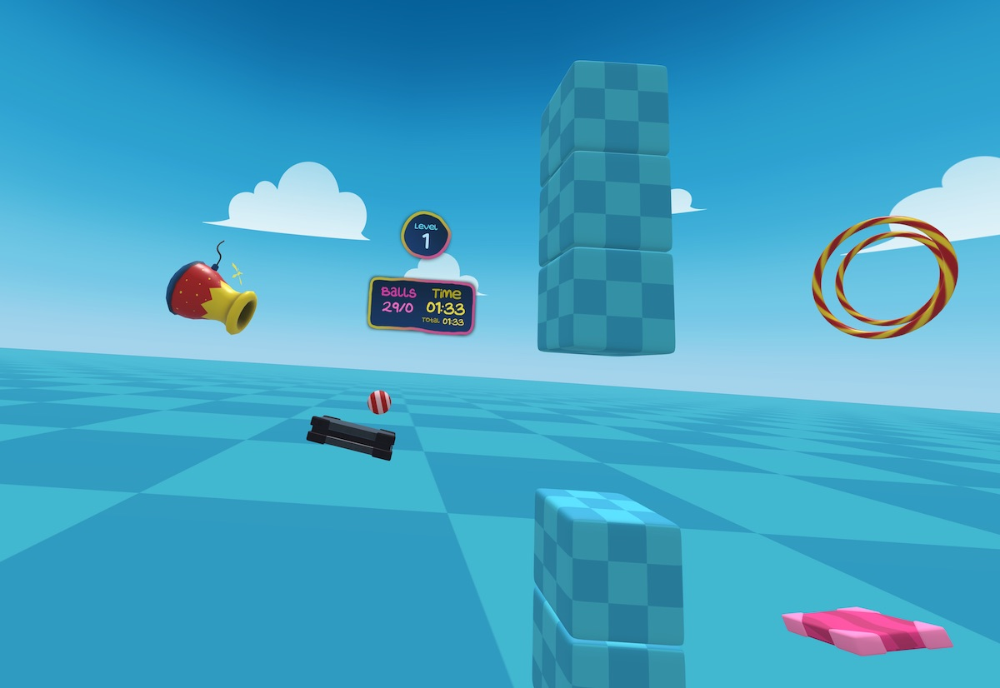

# Jumpy Balls - Now with AR passthrough!
[New version with AR here](https://devpika.github.io/jumpy-balls-xr/)

## Development Environment Setup
1. `npm ci --legacy-peer-deps` to get a "clean install" or "continuous integration" version of the npm packages. This forces npm to use the exact versions from `package-lock.json`
2. `npm run start` for starting the webpack dev server
3. `npm run build` to create production-ready `bundle.js` and `bundle.js.map`

See `package.json` for other scripts.

> NOTE: As the master branch of the main repo from Mozilla did not work right away, getting the project to build successfully was a bit tricky. The latest commit on the main branch uses `ecsy-three@0.0.4` but fails to build successfully (because of breaking changes in the API?). This branch diverges from an older commit that uses a deprecated version (`ecsy-three@0.1.0`). The naming is weird as it has a higher version number despite being older. Compare the npm release history with the `package.json` changes in the repo for a clearer picture.

## Original links from Mozilla
More info on: https://blog.mozvr.com/jumpy-balls

A little physics game using:
- [ecsy](https://ecsy.io)
- [three.js](https://threejs.org)
- [ecsy-three](https://github.com/mozillareality/ecsy-three)
- [ammo.js](https://github.com/kripken/ammo.js/)

Give it a try: https://mixedreality.mozilla.org/jumpy-balls/

Read the blog post: https://blog.mozvr.com/jumpy-balls

## Credits
* [MozillaReality](https://github.com/MozillaReality)
* [Fernando Serrano](https://github.com/fernandojsg)
* [Diego F. Goberna](https://github.com/feiss)
* [Asset credits in its own README](./assets/raw_assets/README.md)
